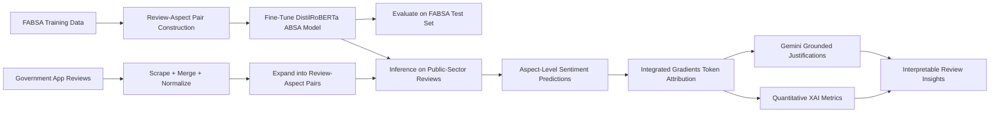

# Sentiment Analysis Research Project

**Interpretable Fine-Grained Aspect-Based Sentiment Analysis for Public-Sector Mobile App Reviews**

---

## 📄 Start Here: Full Research Paper

> **The full project paper is included in this repository:**
> [`Interpretable_Fine_Grained_ABSA_Public_Sector_App_Reviews.pdf`](Interpretable Fine-Grained ABSA of Public-Sector App Reviews with Integrated Gradients and LLM Justifications.pdf)
)
>
> This README gives a mixed technical and non-technical overview of the project. The paper provides the complete research context, methodology, evaluation design, figures, and discussion of findings.

---

## Project Overview

This repository contains a complete research and implementation workflow for **fine-grained Aspect-Based Sentiment Analysis (ABSA)** on public-sector mobile application reviews.

Instead of assigning one overall sentiment label to an entire review, this project predicts sentiment for specific aspects of the user experience, such as app functionality, account access, support, speed, ease of use, and overall satisfaction. This makes the output more actionable because a product or public-service team can identify *what* users are frustrated about rather than only knowing whether a review is positive or negative.

At a high level, the project builds an end-to-end pipeline that:

1. Collects public mobile app reviews from North American government applications.
2. Converts reviews into structured review-aspect pairs.
3. Fine-tunes a transformer-based ABSA model using the FABSA benchmark.
4. Applies the model to North American public-sector app reviews.
5. Uses Integrated Gradients and LLM-generated justifications to explain predictions.
6. Evaluates both predictive performance and explanation quality.

---

## Why This Project Matters

Public-sector mobile apps are often essential digital services, but user feedback is difficult to analyze manually at scale. Reviews are noisy, informal, multi-topic, and often contain several opinions in one sentence. A standard sentiment classifier may label a review as simply “negative,” but it may miss that the complaint is specifically about login access, technical crashes, or service speed.

This project addresses that gap by combining:

- **Fine-grained sentiment modeling** to identify sentiment at the aspect level.
- **Transformer-based NLP** to handle contextual and informal review text.
- **Explainable AI** to show which words or phrases influenced the prediction.
- **LLM-generated justifications** grounded in attribution evidence, making outputs easier for non-technical stakeholders to interpret.
- **Quantitative XAI evaluation** to test whether explanations behave consistently and faithfully.

---

## What This Project Demonstrates

This project is designed to show both practical data science execution and research-level ML thinking.

| Area                   | What Was Built                                                                                    | Why It Matters                                                                          |
| ---------------------- | ------------------------------------------------------------------------------------------------- | --------------------------------------------------------------------------------------- |
| Data engineering       | Review scraping, batch collection, merging, and schema normalization                              | Creates a reproducible pipeline for collecting public app feedback.                     |
| NLP modeling           | DistilRoBERTa-based ABSA classifier                                                               | Enables aspect-specific sentiment prediction rather than coarse review-level sentiment. |
| Dataset construction   | Dense review-aspect pair generation across 12 FABSA aspects                                       | Converts a multi-label ABSA task into a scalable supervised learning format.            |
| Evaluation             | Accuracy, micro-F1, macro-F1, precision, recall, confusion matrix, and Cohen’s κ                | Measures performance beyond simple accuracy, especially under class imbalance.          |
| Explainability         | Integrated Gradients token attributions using Captum                                              | Identifies which tokens supported or opposed each model prediction.                     |
| LLM reasoning layer    | Gemini-generated natural-language justifications grounded in IG evidence                          | Makes model decisions more understandable for non-technical users.                      |
| XAI validation         | Comprehensiveness, sufficiency, sparsity, monotonicity, local sensitivity, and polarity alignment | Tests whether explanations are meaningful rather than decorative.                       |
| Research communication | Full technical paper and structured README                                                        | Connects implementation details to research motivation, results, and limitations.       |

---

## End-to-End Workflow



---

## Methodology Summary

### 1. Data Collection

Government mobile applications were identified across public-facing sources and app stores. Review data was collected from the **Google Play Store** and **Apple App Store** using a custom scraping workflow.

**Implemented components:**

- Single-app scraping with `scrape_reviews.py`
- Batch scraping across government apps with `batch_scrape.py`
- Output merging and deduplication with `merge_batch_results.py`
- App metadata tracking through `App_IDs_List.xlsx`

**High-level purpose:** collect public user feedback from government apps in a structured, reproducible format.

**Technical purpose:** produce normalized review-level CSV files that can be expanded into model-ready review-aspect pairs.

---

### 2. Dataset Construction

The model is trained using the **FABSA dataset**, a benchmark dataset for feedback-oriented aspect-based sentiment analysis. Each review is expanded across the predefined FABSA aspect taxonomy.

For each review, the pipeline creates one row per candidate aspect:

```text
(review text, aspect label) → sentiment class
```

The classification setup uses four output classes:

| Class    | Meaning                                      |
| -------- | -------------------------------------------- |
| Positive | Aspect is present and sentiment is positive. |
| Neutral  | Aspect is present and sentiment is neutral.  |
| Negative | Aspect is present and sentiment is negative. |
| Absent   | Aspect is not discussed in the review.       |

This design allows the original multi-label ABSA problem to be modeled as a repeatable four-class classification task for every review-aspect pair.

---

### 3. Sentiment Modeling

The core model is a **DistilRoBERTa-based aspect-sentiment classifier** fine-tuned in a sentence-pair classification format:

```text
[review text] + [aspect label] → predicted aspect sentiment
```

DistilRoBERTa was used because it provides strong transformer-based language understanding while being more efficient than larger RoBERTa-style models. The model is trained to learn whether a specific aspect is present in a review and, when present, whether the expressed sentiment is positive, neutral, or negative.

**Key technical steps:**

- Tokenize review-aspect pairs with the Hugging Face tokenizer.
- Fine-tune the transformer model using cross-entropy loss.
- Use batched training and evaluation through the Hugging Face `Trainer` workflow.
- Save trained model and tokenizer artifacts for inference.
- Run batched inference on public-sector app review pairs.

---

### 4. Model Evaluation

The model is evaluated on held-out FABSA test pairs using metrics that capture both overall predictive accuracy and behavior under class imbalance.

**Evaluation metrics include:**

- Accuracy
- Micro-F1
- Macro-F1
- Macro precision
- Macro recall
- Confusion matrix
- Cohen’s κ for chance-corrected agreement

**Why this matters:** FABSA contains class imbalance, especially because many review-aspect combinations are absent. Using macro-level metrics and Cohen’s κ helps evaluate whether the model is learning meaningful aspect-sentiment patterns rather than only predicting majority classes.

---

### 5. Explainable AI Pipeline

The explainability layer is included because public-sector analytics should not only produce predictions, but also provide transparent reasoning that can be audited.

The XAI pipeline has three layers:

#### A. Token-Level Attribution with Integrated Gradients

Integrated Gradients is used to estimate which tokens contributed most strongly to a predicted sentiment label. The pipeline extracts both:

- **Supporting evidence:** tokens or phrases that pushed the model toward the predicted label.
- **Opposing evidence:** tokens or phrases that pushed against the predicted label.

#### B. Natural-Language Justifications with Gemini

A Gemini-based explanation layer converts attribution evidence into short natural-language justifications. These justifications are grounded in the Integrated Gradients evidence so that the explanation is tied to model behavior rather than being a free-form summary.

#### C. Quantitative Explanation Quality Metrics

The project also evaluates explanation behavior using XAI metrics such as:

- Comprehensiveness
- Sufficiency
- Sparsity
- Monotonicity
- Local sensitivity
- Polarity alignment

**Why this matters:** the goal is not only to generate explanations, but to test whether those explanations behave consistently when important tokens are removed, retained, or perturbed.

---

## Repository Structure

```text
Sentiment-Analysis-Research-Project/
│
├── Interpretable_Fine_Grained_ABSA_Public_Sector_App_Reviews.pdf
│   # Full research paper: motivation, methodology, results, XAI analysis, and discussion
│
├── app_scraper/
│   ├── App_IDs_List.xlsx
│   │   # Reference list of government app IDs and metadata
│   ├── batch_scrape.py
│   │   # Runs scraping across multiple apps listed in App_IDs_List.xlsx
│   ├── scrape_reviews.py
│   │   # Scrapes reviews for a single app-store listing
│   ├── merge_batch_results.py
│   │   # Merges per-app review files into a unified dataset
│   ├── scraper_requirements.txt
│   │   # Dependencies for the scraping environment
│   └── terminal_cmds_guide.md
│       # Command-line guide for reproducing the scraping workflow
│
├── data/
│   └── fabsa/
│       ├── fabsa_dataset.csv
│       │   # Full normalized FABSA dataset
│       ├── train.csv
│       │   # Review-level training split
│       ├── dev.csv
│       │   # Review-level validation split
│       ├── test.csv
│       │   # Review-level test split
│       ├── train_pairs.csv
│       │   # Expanded review-aspect training pairs
│       └── dev_pairs.csv
│           # Expanded review-aspect validation pairs
│
├── notebooks/
│   ├── Sentiment_Analysis_Project_FABSA_Section.ipynb
│   │   # Main modeling notebook: FABSA processing, pair construction, training, inference, evaluation
│   │
│   ├── Sentiment_Analysis_Project_XAI_Section.ipynb
│   │   # Explainability notebook: Integrated Gradients, Gemini justifications, XAI metrics
│   │
│   └── report_statistics.ipynb
│       # Aggregated statistics, plots, tables, and paper-supporting outputs
│
├── Full Version Prediction XAI and Gemini Sample.xlsx
│   # Sample model predictions with attribution evidence and LLM-generated justifications
│
├── requirements.txt
│   # Main project dependencies
│
├── README.md
│   # Project documentation
│
├── .gitignore
└── .gitattributes
```

---

## Key Outputs

| Output                           | Description                                                                           |
| -------------------------------- | ------------------------------------------------------------------------------------- |
| Fine-tuned ABSA model workflow   | Trains and evaluates a DistilRoBERTa-based classifier on review-aspect pairs.         |
| Public-sector review predictions | Applies the trained model to government app reviews at the aspect level.              |
| XAI attribution outputs          | Identifies supporting and opposing text spans for predictions.                        |
| Gemini justification sample      | Converts attribution evidence into readable explanations.                             |
| XAI metric outputs               | Evaluates explanation faithfulness, compactness, stability, and polarity consistency. |
| Full research paper              | Provides the complete academic write-up and interpretation of the system.             |

---

## How to Reproduce the Project

### 1. Install dependencies

```bash
pip install -r requirements.txt
```

For scraping-specific dependencies, use:

```bash
pip install -r app_scraper/scraper_requirements.txt
```

### 2. Optional: Reproduce review scraping

See:

```text
app_scraper/terminal_cmds_guide.md
```

Typical workflow:

```bash
python app_scraper/batch_scrape.py
python app_scraper/merge_batch_results.py
```

### 3. Run the modeling notebook

```text
notebooks/Sentiment_Analysis_Project_FABSA_Section.ipynb
```

This notebook covers:

- FABSA loading and cleaning
- Train/dev/test split setup
- Review-aspect pair construction
- DistilRoBERTa fine-tuning
- Model evaluation
- Government app review inference

### 4. Run the explainability notebook

```text
notebooks/Sentiment_Analysis_Project_XAI_Section.ipynb
```

This notebook covers:

- Integrated Gradients attribution
- Evidence phrase extraction
- Gemini justification generation
- XAI metric computation
- Explanation output assembly

### 5. Review paper-supporting statistics

```text
notebooks/report_statistics.ipynb
```

This notebook supports final tables, figures, and aggregate summaries used in the written paper.

---

## Technical Stack

| Category                  | Tools / Libraries                              |
| ------------------------- | ---------------------------------------------- |
| Programming               | Python                                         |
| NLP modeling              | Hugging Face Transformers, DistilRoBERTa       |
| Deep learning             | PyTorch                                        |
| Data processing           | pandas, NumPy                                  |
| Evaluation                | scikit-learn, evaluate                         |
| Explainability            | Captum Integrated Gradients                    |
| LLM explanations          | Gemini                                         |
| Visualization / reporting | matplotlib, notebooks, Excel outputs           |
| Data collection           | Google Play / Apple App Store scraping scripts |

---

## Notes on Large Artifacts

Some artifacts may be too large to store directly in GitHub, depending on repository settings. These may include:

- Fine-tuned model checkpoints
- Intermediate prediction files
- Full scraped review datasets
- Expanded review-aspect inference outputs

When these artifacts are not committed, they can be regenerated by following the notebook and scraping workflow.

## Ethical Considerations

- The project uses publicly available user-generated reviews.
- The analysis is conducted at aggregate and review-text levels rather than attempting to identify individuals.
- Explainability is included to make model behavior more transparent and auditable.
- LLM-generated explanations are grounded in attribution evidence to reduce the risk of unsupported rationales.
- The project is intended to support responsible feedback analysis and public-service improvement, not automated decision-making about individual users.

---

## Author

**Taksh Girdhar**
BSc Data Science — University of British Columbia, Okanagan
DATA 448 — Research Project

---

## Citation / Project Reference

If referencing this project, start with the included paper:

```text
Girdhar, T., & Adaji, I. Interpretable Fine-Grained ABSA of Public-Sector App Reviews with Integrated Gradients and LLM Justifications. University of British Columbia, Okanagan.
```
